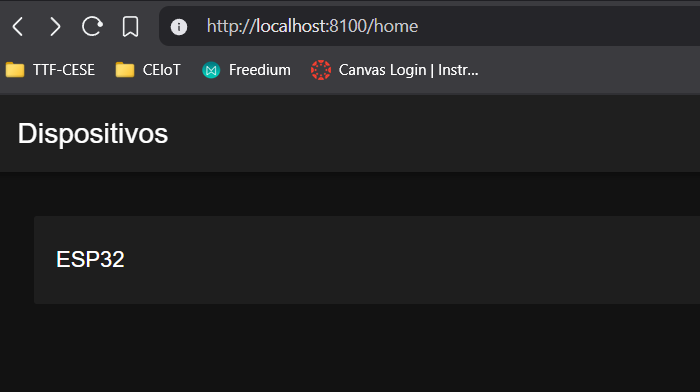
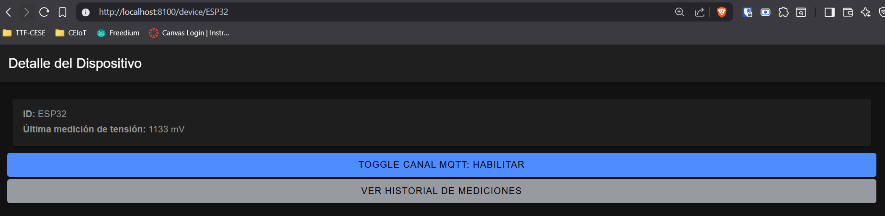
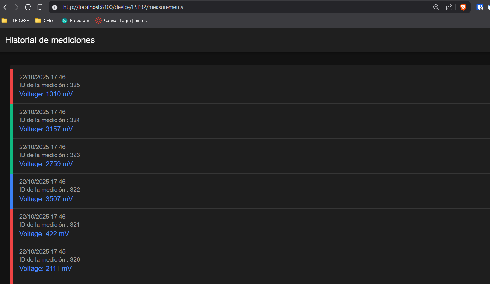

 ## 📘 Trabajo Práctico Final — Aplicación IoT de Riego con Ionic + Node.js + MySQL
========================================

 ### 👤 Autores
    Martin Duarte

Proyecto basado en [Web App Full Stack Base](https://github.com/gotoiot/app-fullstack-base).

En esta extensión del proyecto se utiliza el framework ionic para realizar el frontend.

## Comenzando 🚀

Esta sección es una guía con los pasos esenciales para que puedas poner en marcha la aplicación.

### Instalar las dependencias

Para correr este proyecto es necesario que instales `Docker` y `Docker Compose`. 

En [este artículo](https://www.gotoiot.com/pages/articles/docker_installation_linux/) publicado en nuestra web están los detalles para instalar Docker y Docker Compose en una máquina Linux. Si querés instalar ambas herramientas en una Raspberry Pi podés seguir [este artículo](https://www.gotoiot.com/pages/articles/rpi_docker_installation) de nuestra web que te muestra todos los pasos necesarios.

En caso que quieras instalar las herramientas en otra plataforma o tengas algún incoveniente, podes leer la documentación oficial de [Docker](https://docs.docker.com/get-docker/) y también la de [Docker Compose](https://docs.docker.com/compose/install/).

Continua con la descarga del código cuando tengas las dependencias instaladas y funcionando.

### Ejecutar la aplicación

Para ejecutar la aplicación tenes que correr el comando `docker compose up` desde la raíz del proyecto. Este comando va a descargar las imágenes de Docker de node, de typescript, de la base datos y del admin de la DB, y luego ponerlas en funcionamiento. 

Para acceder al cliente web ingresa a a la URL [http://localhost:8100/](http://localhost:8100/) y para acceder al admin de la DB accedé a [localhost:8001/](http://localhost:8001/). 

Si pudiste acceder al cliente web y al administrador significa que la aplicación se encuentra corriendo bien. 

> Si te aparece un error la primera vez que corres la app, deteńe el proceso y volvé a iniciarla. Esto es debido a que el backend espera que la DB esté creada al iniciar, y en la primera ejecución puede no alcanzar a crearse. A partir de la segunda vez el problema queda solucionado.

## 📋 Descripción

Este proyecto implementa una aplicación en Ionic/Angular con un backend Node.js + Express y base de datos MySQL para gestionar dispositivos IoT (sensores de humedad y electroválvulas de riego).

La app permite:

- Ver un listado de dispositivos con su nombre.

- Consultar el detalle de un dispositivo con su última medición.

- Habilitar y Deshabilitar canal MQTT (toggle).

- Registrar automáticamente la medición de voltaje medida por el microcontrolador.

- Visualizar el historial de mediciones de cada dispositivo.

Cumple los requisitos del enunciado:

- Lecturas desde BD: solo en /home (lista de dispositivos) y /device/:id/measurements (histórico).

- Escrituras: Se consolida en la base de datos al momento en que el dispositivo reporta una medición y el dispositivo se encuentra registrado..

## ⚙️ Tecnologías utilizadas

- Frontend: Ionic 7.2.1 + Angular 18.2.11 (standalone components, @for/@if, pipes, directivas).
- Backend: Node.js (v22.17.0) + Express + MySQL.
- Base de datos: MySQL.

📂 Estructura principal

    /frontend
    ├──dam
        ├──src        
        ├── src/app/device-manager              # Página Home (/home)
        ├── src/app/pages/device-detail         # Página detalle (/device/:id)
        ├── src/app/pages/measurements          # Página historial (/device/:id/measurements)
        ├── src/app/services/database.service.ts        # Servicio para requests a BD
        ├── src/app/pipes/apertura-label.pipe.ts            # Pipe para formatear atributo apertura
        ├── src/app/directives/humidity-color.directive.ts  # Directiva para colorear histórico.
        ├── src/app/interfaces/IDevices.ts                  # Interfaz para dispositivos de BD.
        ├── src/app/interfaces/IMeasurements.ts             # Interfaz para dato histórico de BD.
        ├── src/app/pages/device-detail                     # Página de detalle de dispositivo.
        ├── src/app/pages/measurements/measurement          # Página de mediciones 
        
    /backend
    ├── devices/index.js             # Rutas /devices
    ├── mqtt/index.js                # Rutas /mqtt
    ├── mysql-connector.js           # Pool de conexión MySQL

## Endpoints creados sobre el backend

Sobre la API backend se crearon los siguientes endpoints: 

    Obtener todos los dispositivos
    GET     devices

    Obtener dispositivo por id:
    GET     devices/:id

    Obtener todas las mediciones:
    GET     devices/measurements

    Obtener última medicion por id de dispositivo:
    GET     devices/:id/last-measurement
    
    Obtener mediciones por id de dispositivo
    GET     devices/:id/measurements

    Habilitar / Deshabilitar canal MQTT.
    POST    '/:DeviceID/enable-mqtt/:enable'

📸 Capturas

Capturas del la página de inicio donde se muestran todos
los dispositivos.

Al hacer click, se puede ir a un modal de detalle de cada dispositivo. 

Apretando el botón de histórico de mediciones se accede a la siguiente página.
Los colores que se presentan en cada cuadro guardan relación con la humedad de cada medición.
- Niveles bajos (verdes) corresponden a niveles por debajo del 30 %
- Niveles altos (rojos) corresponden a niveles por encima del 60 %
- Niveles intermedios (azules) corresponden a niveles entre 30 - 60 %

## Licencia 📄

Este proyecto está bajo Licencia ([MIT](https://choosealicense.com/licenses/mit/)). Podés ver el archivo [LICENSE.md](LICENSE.md) para más detalles sobre el uso de este material.
